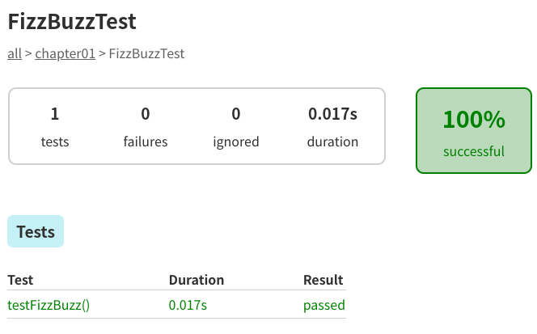

# Chapter 01: FizzBuzzプログラム
以下の要件を満たすソースコードを実装してください。

- FizzBuzz関数を作成し、引数として「整数」を受け取れるようにすること。FizzBuzz関数は以下の仕様を満たす。
  - 引数が3の倍数の場合は、「Fizz」を返す。
  - 引数が5の倍数の場合は、「Buzz」を返す。
  - 引数が3の倍数かつ5の倍数の場合（すなわち15の倍数の場合）は、「Fizz Buzz」を返す。
  - 上記のいずれでもない場合は、引数の整数値を文字列として返す
- FizzBuzz関数に1〜100までの数値を順番に渡し、FizzBuzz関数の返り値を標準出力すること
- FizzBuzz関数に対するユニットテストがあること

# 期待値（一部省略）
```
1
2
Fizz
4
Buzz
Fizz
7
8
Fizz
Buzz
11
Fizz
13
14
FizzBuzz
```


# 実行結果
ここに実行結果を貼ってください

# ユニットテスト実行結果
ここにユニットテスト実行結果を貼ってください

# 実行結果: Kotlin
```
$ ./gradlew  run

> Task :app:run
1
2
Fizz
4
Buzz
Fizz
7
8
Fizz
Buzz
11
Fizz
13
14
FizzBuzz
16
17
Fizz
19
Buzz
Fizz
22
23
Fizz
Buzz
26
Fizz
28
29
FizzBuzz
31
32
Fizz
34
Buzz
Fizz
37
38
Fizz
Buzz
41
Fizz
43
44
FizzBuzz
46
47
Fizz
49
Buzz
Fizz
52
53
Fizz
Buzz
56
Fizz
58
59
FizzBuzz
61
62
Fizz
64
Buzz
Fizz
67
68
Fizz
Buzz
71
Fizz
73
74
FizzBuzz
76
77
Fizz
79
Buzz
Fizz
82
83
Fizz
Buzz
86
Fizz
88
89
FizzBuzz
91
92
Fizz
94
Buzz
Fizz
97
98
Fizz
Buzz
```

# ユニットテスト実行結果
```
$ ./gradlew test

BUILD SUCCESSFUL in 685ms
3 actionable tasks: 3 up-to-date
```
 